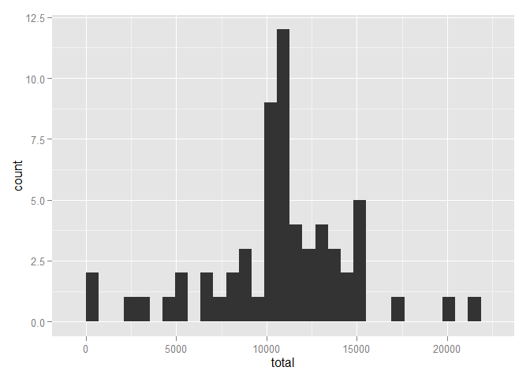

# Reproducible Research: Peer Assessment 1
Paul Fornia  
Saturday, May 16, 2015  


## Loading and preprocessing the data

First, we load the raw data and take a look at the first few rows.


```r
rawData <- read.csv("activity.csv")
head(rawData)
```

```
##   steps       date interval
## 1    NA 2012-10-01        0
## 2    NA 2012-10-01        5
## 3    NA 2012-10-01       10
## 4    NA 2012-10-01       15
## 5    NA 2012-10-01       20
## 6    NA 2012-10-01       25
```

Next, we'll create a second dataframe in which we've remove the NA values from the raw data. We'll again look at the first few rows. 


```r
stepsData <- rawData[!is.na(rawData$steps),]
head(stepsData)
```

```
##     steps       date interval
## 289     0 2012-10-02        0
## 290     0 2012-10-02        5
## 291     0 2012-10-02       10
## 292     0 2012-10-02       15
## 293     0 2012-10-02       20
## 294     0 2012-10-02       25
```


## What is mean total number of steps taken per day?

Using the dataframe without NAs, we can summarise the data on the date, and calculate the total steps taken by day. Then, we'll plot a histogram of this daily total.


```r
library(plyr)
library(ggplot2)
```

```
## Warning: package 'ggplot2' was built under R version 3.1.3
```

```r
stepsByDay <- ddply(stepsData, ~date, summarise, total = sum(steps))
ggplot(stepsByDay, aes(total)) + geom_histogram()
```

```
## stat_bin: binwidth defaulted to range/30. Use 'binwidth = x' to adjust this.
```

 

Let's calculate the mean and median of this daily total number of steps.


```r
mean(stepsByDay$total)
```

```
## [1] 10766.19
```

```r
median(stepsByDay$total)
```

```
## [1] 10765
```

## What is the average daily activity pattern?

Just as we summarized on date above, we can take a mean summary by interval to look at the activity pattern over a "typical" day. We'll plot the average steps taken in a 5-minute period against the intervals over the course of the day.


```r
avgStepsByInt <- ddply(stepsData, ~interval, summarise, avgSteps = mean(steps))
ggplot(avgStepsByInt, aes(x = interval, y = avgSteps)) + geom_line()
```

 

From this pattern, we can see which point during the day has the highest average number of steps taken.


```r
avgStepsByInt$interval[avgStepsByInt$avgSteps == max(avgStepsByInt$avgSteps)]
```

```
## [1] 835
```

## Imputing missing values

Let's find out how many of the observations from the original raw data were missing values for number of steps taken.


```r
table(is.na(rawData$steps))
```

```
## 
## FALSE  TRUE 
## 15264  2304
```

It looks like the majority of observations were not missing. With the "typical" day pattern calculated above, we can fill in any NA values from the raw data.


```r
stepsFilled <- rawData
for(i in 1:dim(rawData)[1]){    
    if(is.na(rawData$steps[i])){
        avgIntSteps <- avgStepsByInt$avgSteps[avgStepsByInt$interval == rawData$interval[i]]
        stepsFilled$steps[i] <- avgIntSteps
    }
}
```

Just as we plotted a histogram of the non-missing data above, we can look at the distribution of this "filled in" data.


```r
stepsByDayFilled <- ddply(stepsFilled, ~date, summarise, total = sum(steps))
ggplot(stepsByDayFilled, aes(total)) + geom_histogram()
```

```
## stat_bin: binwidth defaulted to range/30. Use 'binwidth = x' to adjust this.
```

 

```r
mean(stepsByDayFilled$total)
```

```
## [1] 10766.19
```

```r
median(stepsByDayFilled$total)
```

```
## [1] 10766.19
```

As we see, the data changed just slightly when we imputed missing values.

## Are there differences in activity patterns between weekdays and weekends?

We create a factor variable to distinguish between weekdays and weekends. We'll use R's built-in weekdays() function. If a date's weekdays() value is "Saturday" or "Sunday", we'll flag the date as a weekend. Otherwise, we'll flag it as a weekday. 


```r
stepsFilled$weekday <- "weekday"
tempWeekdays <- weekdays(as.Date(stepsFilled$date, "%Y-%m-%d"))
stepsFilled$weekday[tempWeekdays == "Saturday" | tempWeekdays == "Sunday"] <- "weekend"
stepsFilled$weekday <- as.factor(stepsFilled$weekday)
```

Just as we summarized on the interval above to get a typical day's step pattern, we'll now summarize on interval and weekday flag to get the typical weekday's pattern, as well as the typical weekend day's pattern.


```r
avgWeekStepsByInt <- ddply(stepsFilled, ~interval + weekday, summarise, avgSteps = mean(steps))
ggplot(avgWeekStepsByInt, aes(x = interval, y = avgSteps)) + geom_line() + facet_grid(weekday ~ .)
```

 

As one might expect, the plot stays near zero for longer on a weekend. On a weekday, people might be waking up earlier for work, which is reflected by an early small spike in the data about an hour before the weekend data takes off. 

We also note that this early spike in the weekday is not nearly as large as the largest spike (probably a lunch-time spike). This is likely due to the fact that only a fraction of commuters are likely to walk a significant distance to work. The majority of users are likely driving or do not walk far to a bus stop.

Finally, the weekend data takes longer to flatten out near the end of the day, indicating the the typical person may go to sleep a little later on weekends.
